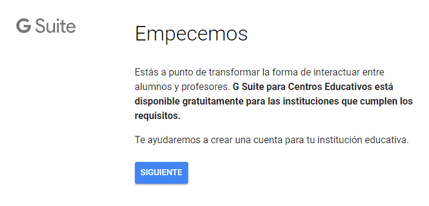

## 1.4\. El registro en Google for Education {#1-4-el-registro-en-google-for-education}

Presentamos cómo se adquiere este servicio, proceso que no es necesario para seguir este curso.

El primer paso consiste en [registrar al centro educativo](https://www.google.com/url?q=https://support.google.com/a/answer/2856827?hl%3Des&sa=D&ust=1540994740405000) a través del formulario G Suite for Education. Ahí el Administrador del centro tiene que ir dando la información necesaria, que Google comprueba.

Fig. 3\. Primera parte del formulario de registro en G Suite for Education.

A continuación hay que verificar la propiedad del dominio. Para eso se debe iniciar sesión en la Consola de Administración y hacer clic en el enlace que se muestra en la parte superior del panel de control.

En los días siguientes, Google revisa la solicitud y se pone en contacto con el centro por correo electrónico o por teléfono. Una vez que la dan por aceptada, el Administrador puede empezar a configurar las aplicaciones que se necesiten y a crear usuarios.