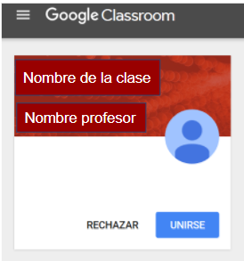
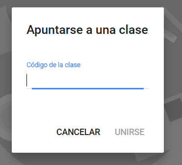
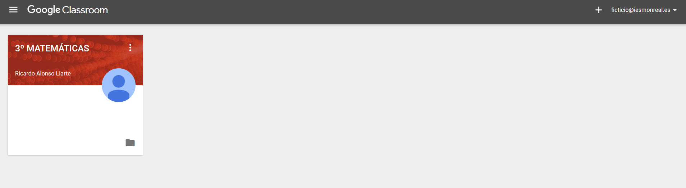

## Apuntarse a una clase {#1-9-apuntarse-a-una-clase}

Un alumno al entrar en Classroom puede ver las clases en las que está inscrito. Para estar en una clase tiene dos posibilidades:

*   El profesor le invita a una clase y el alumno solo debe aceptar.

Fig 10\. Aceptar la invitación a una clase

*   El alumno se apunta a una clase de la que conoce el código de la misma. En este caso al darle al botón con el signo +, la aparece esta pantalla:

Fig 11\. Apuntarse a una clase

En las sucesivas veces que entre en la plataforma solo deberá elegir a qué clase se dirige, pues le aparecerán todas en las que está inscrito.

Fig 12\. Imagen del muro con las clases en las que se está inscrito

En la parte inferior derecha de cada una de las clases aparecer el icono de una carpeta que da acceso a la carpeta de Drive de esa clase y el acceso al listado de tareas pendientes. Se explicará más adelante.