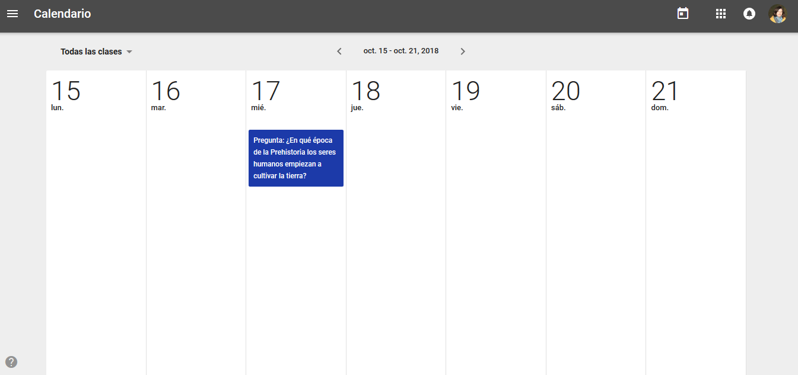
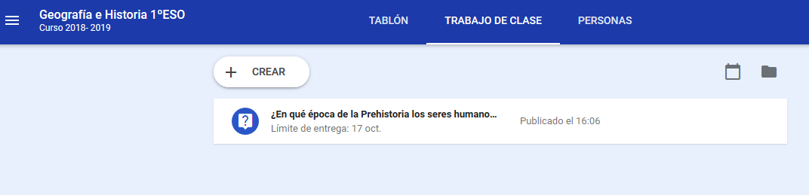

## 2.4\. El calendario de Classroom {#2-4-el-calendario-de-classroom}

Google Classroom crea un calendario para cada clase y añade un calendario más a nuestro Google Calendar. A ambos podemos acceder desde el apartado “Información” de la clase:

*   Existe el Calendario de Classroom, que automáticamente recoge la fecha de entrega de las tareas que hemos creado pero a día de hoy no permite que añadamos nada manualmente. El calendario también es accesible desde la página de inicio de Google Classroom.

*   En cuanto creamos una clase, se añade un nuevo calendario en nuestro Google Calendar. Podemos acceder entrando directamente en esta aplicación o bien a través del icono que hay en la esquina superior derecha del apartado “Trabajo de clase”:

 

Este calendario también recoge la fecha de entrega de tareas de Classroom pero en este caso sí lo podemos editar (como cualquier otro calendario de esta aplicación). Por ejemplo, de forma manual podemos añadir las fechas de los exámenes o de una excursión y compartir el calendario con los alumnos.

[insertar presentación Módulo 2_2.4]