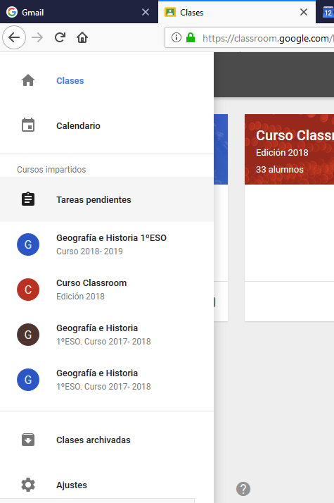
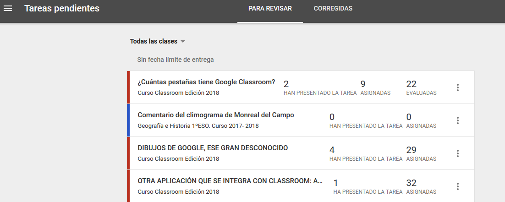
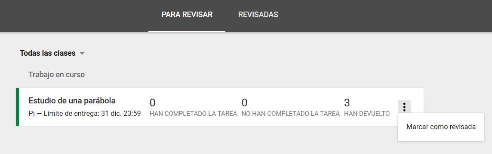
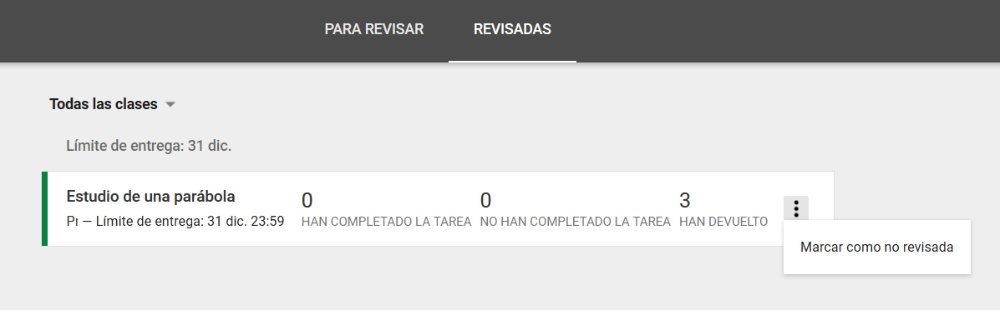

## 3.6\. Gestión de las tareas {#3-6-gesti-n-de-las-tareas}

Todas las tareas que proponemos a los alumnos quedan registradas en el menú principal y desde allí podemos darlas por finalizadas, archivándolas.

   Al hacer clic en el icono de la imagen, se despliega el menú de clases, calendario, etc. Allí se pueden ver los cursos impartidos y aquellos en los que estamos inscritos.

Vemos el acceso directo a “Tareas pendientes” que, al hacer clic sobre él, muestra todas las tareas pendientes (para revisar) y realizadas (revisadas) de todas las clases o de la que seleccionemos en el desplegable.

Cuando se quiera dar por finalizada una tarea, en los tres puntos de la derecha de la misma aparece la opción de marcar como revisada,

que hace que la tarea se archive, y pasa al menú Revisadas, en el que también está disponible la posibilidad de volver a activar la tarea marcándola como no revisada.

Independientemente de que la tarea esté o no archivada, si se clica sobre el título, se abre la ventana de Classroom con toda la información de alumnos y archivos enviados, como se ha visto en el apartado 3.3.