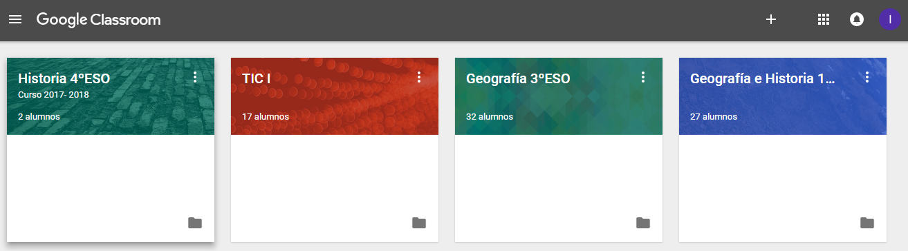
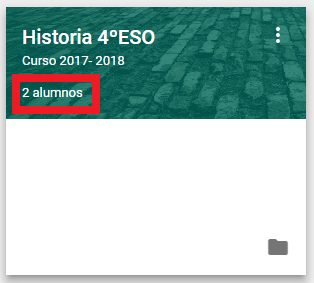
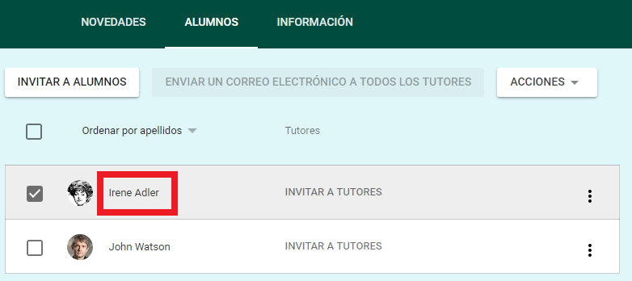
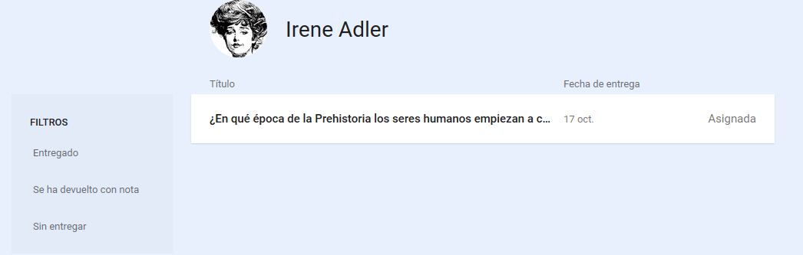

## 3.7\. Seguimiento personalizado {#3-7-seguimiento-personalizado}

Hemos visto las diversas formas desde las que controlar el trabajo de cada alumno, que normalmente realizamos con cada tarea. Una de las últimas actualizaciones de Google Classroom (agosto de 2017) mejoró este sistema de control proporcionándonos un acceso rápido al listado total de tareas y calificaciones de cada alumno, del mismo modo que ellos también pueden consultar, en una sola página, sus progresos en cada clase.

Podemos consultar esta ficha individual accediendo desde el apartado “Personas”, o bien directamente desde la página de inicio de Classroom:

Pinchamos en el número de alumnos de la miniatura de la clase:

A continuación, en el nombre del alumno cuyo progreso queramos conocer:

Aparece su historial con la lista de todas las tareas o preguntas, el estado de las mismas, la calificación, etc. Pinchando en cada tarea también podríamos entrar a la revisión y corrección de la misma:

<iframe src="https://docs.google.com/presentation/d/e/2PACX-1vQ_vEBlQQQcY55Fb5EhlpK8kzrnN6uB3YMzD61hTSY45lXUiPLfTphidd3h5Dav5245h5pyrAoGuk46/embed?start=false&loop=false&delayms=3000" frameborder="0" width="100%" height="569" allowfullscreen="true" mozallowfullscreen="true" webkitallowfullscreen="true"></iframe>
