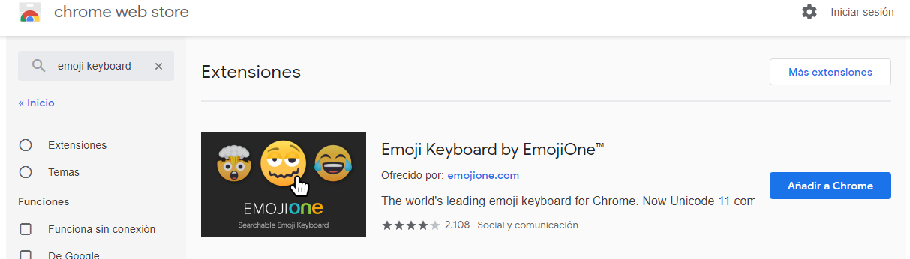
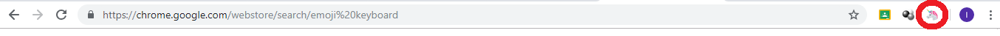
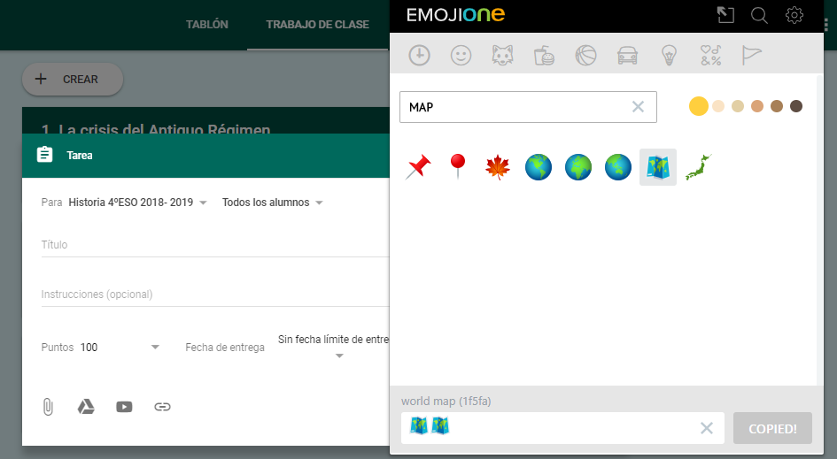
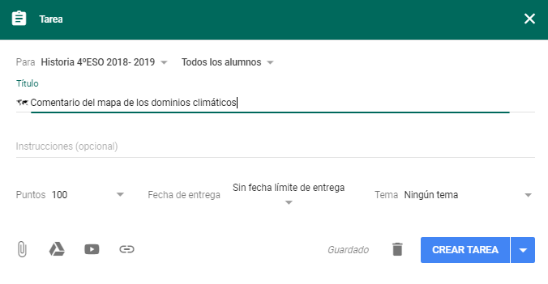

## 

### 4.2.2\. Talk and Comment {#4-2-2-talk-and-comment}

Esta extensión permite crear una nota de audio y colocarla en el sitio que deseemos, ya sea en Classroom o incluso en Drive, de manera que podemos dar instrucciones, anunciar o corregir tareas mediante  notas de voz. Desde luego, es una ayuda a la accesibilidad de los contenidos y hace que Classroom sea más versátil, abriendo su uso a alumnos de los primeros cursos de Primaria, incluso Infantil.  

[insertar presentacion Mod4_4.2.2]

### 4.2.3\. Emoji Keyboard {#4-2-3-emoji-keyboard}

Los editores de texto para las tareas y publicaciones de Classroom son muy sencillos. Por eso, en ocasiones, puede interesarnos incluir algún icono que facilite la visualización y clasificación de los contenidos.  Existen diversos complementos para el navegador Google Chrome que permiten precisamente esto, como por ejemplo Emoji Keyboard.

Lo encontramos en la Chrome Web Store:

Una vez añadido a Chrome y reiniciado el navegador, veremos el acceso en la esquina superior derecha, junto a la barra de búsqueda:

Para insertar un icono en el texto o título de la tarea, debemos pinchar sobre ese icono del unicornio de nuestro  navegador y buscar el emoticono que queramos. Quedará copiado en el portapapeles a la espera de que lo peguemos en el editor de Classroom.

 

