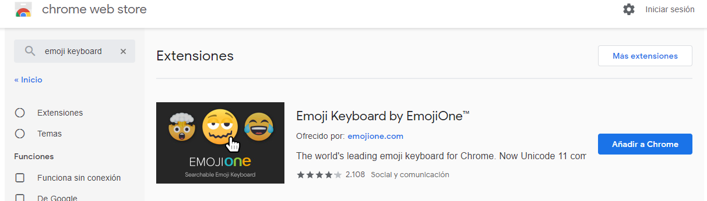
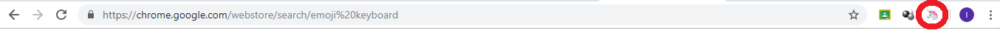

## 4.2\. Extensiones de Google Chrome en Classroom {#4-2-extensiones-de-google-chrome-en-classroom}

###  4.2.1\. “Compartir con Classroom” {#4-2-1-compartir-con-classroom}

Los profesores y alumnos pueden compartir páginas web con la clase gracias a la extensión del navegador Chrome “Compartir con Classroom” o “Share to Classroom”.  Obviamente, solo funciona con el navegador Google Chrome. En Firefox no hay un complemento parecido.

#### ¿Quién puede instalar la extensión?

Los administradores de G Suite pueden preinstalar la extensión para todos los miembros del centro educativo. Si no es el caso, tanto profesores como alumnos pueden instalarla.

#### Instalación por parte de los profesores:

*   Deben buscar la extensión en la tienda Chrome ([https://chrome.google.com/webstore](https://www.google.com/url?q=https://chrome.google.com/webstore&sa=D&ust=1540994740446000)) o dirigirse directamente a [g.co/sharetoclassroom](https://www.google.com/url?q=https://g.co/sharetoclassroom&sa=D&ust=1540994740447000).
*   Clic en “Añadir a Chrome” y después en “Añadir extensión”.
*   El icono aparecerá en la esquina superior derecha, junto a la barra de direcciones.
*   Para compartir una página web con la clase solo hay que hacer clic sobre el icono, siempre y cuando antes hayamos iniciado sesión en nuestro navegador Chrome.

#### Los profesores comparten con la clase:

Se contemplan dos situaciones en las que nos puede resultar útil esta extensión:

*   Queremos que la página web que estamos viendo aparezca inmediatamente en los navegadores de todos los alumnos y profesores invitados (por ejemplo, si estamos en mitad de una clase en la que utilizamos los portátiles y queremos ahorrar tiempo y evitar que los alumnos tecleen la dirección).
*   Estamos creando una tarea, una pregunta o un anuncio y la web es un recurso de apoyo. En ese caso, se nos abrirá un menú para editar la tarea/ pregunta/ anuncio, como sucede cuando creamos cualquier tarea.

#### Los alumnos comparten con el profesor:

Si un alumno de Classroom se añade esta extensión, podrá enviar la web al profesor, y este actuará como filtro antes de que se publique para toda la clase.

<iframe src="https://docs.google.com/presentation/d/e/2PACX-1vT30HgHkLfFtYAtxwghsbJUEPqTrkY61VSnDDSF3TEqxtqVT6e9kWcMZFcLmKO-STls13ZFVKfumUKi/embed?start=false&loop=false&delayms=3000" frameborder="0" width="100%" height="569" allowfullscreen="true" mozallowfullscreen="true" webkitallowfullscreen="true"></iframe>

###  4.2.2\. Talk and Comment

Esta extensión permite crear una nota de audio y colocarla en el sitio que deseemos, ya sea en Classroom o incluso en Drive, de manera que podemos dar instrucciones, anunciar o corregir tareas mediante  notas de voz. Desde luego, es una ayuda a la accesibilidad de los contenidos y hace que Classroom sea más versátil, abriendo su uso a alumnos de los primeros cursos de Primaria, incluso Infantil.

<iframe src="https://docs.google.com/presentation/d/e/2PACX-1vTGdL0p7tENyJlcW6AsaU6oQdRguQQR_lrx7O7lngFd5pKaSN4Frx8XmdJbDzfE1FwCJt8moHdXK-1G/embed?start=false&loop=false&delayms=3000" frameborder="0" width="100%" height="569" allowfullscreen="true" mozallowfullscreen="true" webkitallowfullscreen="true"></iframe>

### 4.2.3\. Emoji Keyboard {#4-2-3-emoji-keyboard}

Los editores de texto para las tareas y publicaciones de Classroom son muy sencillos. Por eso, en ocasiones, puede interesarnos incluir algún icono que facilite la visualización y clasificación de los contenidos.  Existen diversos complementos para el navegador Google Chrome que permiten precisamente esto, como por ejemplo Emoji Keyboard.

Lo encontramos en la Chrome Web Store:

Una vez añadido a Chrome y reiniciado el navegador, veremos el acceso en la esquina superior derecha, junto a la barra de búsqueda:

Para insertar un icono en el texto o título de la tarea, debemos pinchar sobre ese icono del unicornio de nuestro  navegador y buscar el emoticono que queramos. Quedará copiado en el portapapeles a la espera de que lo peguemos en el editor de Classroom.

 

